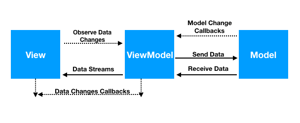

# G39 Report

The following is a report template to help your team successfully provide all the details necessary for your report in a structured and organised manner. Please give a straightforward and concise report that best demonstrates your project. Note that a good report will give a better impression of your project to the reviewers.

*Here are some tips to write a good report:*

* *Try to summarise and list the `bullet points` of your project as many as possible rather than give long, tedious paragraphs that mix up everything together.*

* *Try to create `diagrams` instead of text descriptions, which are more straightforward and explanatory.*

* *Try to make your report `well structured`, which is easier for the reviewers to capture the necessary information.*

*We give instructions enclosed in square brackets [...] and examples for each sections to demonstrate what are expected for your project report.*

*Please remove the instructions or examples in `italic` in your final report.*

## Table of Contents

1. [Team Members and Roles](#team-members-and-roles)
2. [Summary of Individual Contributions](#summary-of-individual-contributions)
3. [Conflict Resolution Protocol](#conflict-resolution-protocol)
4. [Application Description](#application-description)
5. [Application UML](#application-uml)
6. [Application Design and Decisions](#application-design-and-decisions)
7. [Summary of Known Errors and Bugs](#summary-of-known-errors-and-bugs)
8. [Testing Summary](#testing-summary)
9. [Implemented Features](#implemented-features)
10. [Team Meetings](#team-meetings)

## Team Members and Roles

| UID      |       Name        | Role |
|:---------|:-----------------:| ---: |
| u7490271 |    Jerry Zhao     | [role] |
| u7348473 | Karthik Vemireddy | [role] |
| u7499989 | Matthew Richards  | [role] |
| u7124454 |     Ryan Yoon     | [role] |
| u7474428 | Michael Ostapenko | [role] |

## Summary of Individual Contributions

*[Summarise the contributions made by each member to the project, e.g. code implementation, code design, UI design, report writing, etc.]*

*[Code Implementation. Which features did you implement? Which classes or methods was each member involved in? Provide an approximate proportion in pecentage of the contribution of each member to the whole code implementation, e.g. 30%.]*

*Here is an example:*

*UID1, Name1, I contribute 30% of the code. Here are my contributions:*
* A.class
* B.class: function1(), function2(), ...
* ....

*you should ALSO provide links to the specified classes and/or functions*

*[Code Design. What design patterns, data structures, did the involved member propose?]*

*[UI Design. Specify what design did the involved member propose? What tools were used for the design?]*

*[Report Writing. Which part of the report did the involved member write?]*

*[Slide preparation. Were you responsible for the slides?]*

*[Miscellaneous contributions. You are welcome to provide anything that you consider as a contribution to the project or team.]*

## Conflict Resolution Protocol

1. Define the source of the conflict: The mediator will initiate communication with all team members and identify where the conflict lies.
2. Look beyond the incident: Party members will act professionally to not let personal emotions play a part in your actions.
3. Request solutions: The mediator will ask all party members for solutions. If a solution cannot be thought of, then the party's perspective on the situation should be said.
4. Identify solutions both disputants can support: Find the most acceptable solution, a compromise between both/all party members.
5. Agreement: The mediator will ask party members to accept one of the alternatives identified and reach a negotiated agreement

## Application Description
Waddle is an educational app that enables seamless access to school content for university students and teachers. Users can join courses created by teachers, which include content, discussion forums, and participant lists. The app features a search function for finding friends and interesting courses. Users can explore the courses enrolled by other users, including their name and email. Additionally, users can engage in course discussions by posting questions and participating in group chat messaging. Waddle simplifies the educational experience, fostering collaboration and knowledge-sharing among students and teachers.

Waddle offers a user-friendly sign-up process where users can easily create an account by providing essential information such as their first name, last name, username, email, and password. During sign-up, users also have the option to choose their role as a teacher or student, which determines their course management permissions. The app is organised into four tabs: the dashboard, user/course search, notifications, and profile view. After logging in, users are initially greeted with an empty dashboard until they enroll in courses. To join a course, users can navigate to the join course pop-up where they enter a course code provided by their teacher. Alternatively, if no course code is given, users can explore the search tab to manually find and join courses of interest.

Once a user joins a course, it becomes visible on their dashboard. By clicking on the course, users can access information like course content, participants, and discussion forums. The search tab allows users to find and connect with friends, view their enrolled courses, and access their email addresses. In the profile tab, users can view their personal information, including full name, user status, and a list of enrolled courses. Additionally, a convenient logout function is available in the profile tab for users who wish to log out.

*[What is your application, what does it do? Include photos or diagrams if necessary]*

**Application Use Cases and or Examples**

*[Provide use cases and examples of people using your application. Who are the target users of your application? How do the users use your application?]*

*Here is a pet training application example*

*Molly wants to inquiry about her cat, McPurr's recent troublesome behaviour*
1. *Molly notices that McPurr has been hostile since...*
2. *She makes a post about... with the tag...*
3. *Lachlan, a vet, writes a reply to Molly's post...*
4. ...
5. *Molly gives Lachlan's reply a 'tick' response*

*Here is a map navigation application example*

*Targets Users: Drivers*

* *Users can use it to navigate in order to reach the destinations.*
* *Users can learn the traffic conditions*
* ...

*Target Users: Those who want to find some good restaurants*

* *Users can find nearby restaurants and the application can give recommendations*
* ...

*List all the use cases in text descriptions or create use case diagrams. Please refer to https://www.visual-paradigm.com/guide/uml-unified-modeling-language/what-is-use-case-diagram/ for use case diagram.*

## Application UML

  
*[Replace the above with a class diagram. You can look at how we have linked an image here as an example of how you can do it too.]*

## Application Design and Decisions

*Please give clear and concise descriptions for each subsections of this part. It would be better to list all the concrete items for each subsection and give no more than `5` concise, crucial reasons of your design. Here is an example for the subsection `Data Structures`:*

*We used the following data structures in our project:*

**Data Structures**

1. **List**

    * Objective: Lists are used to primarily store a user’s courses. It is also used in custom adapter classes for displaying courses or course participants as a scrollable list in the app.

    * Locations: MockWaddleDatabaseServiceClient.java, WaddleDatabaseServiceClientFactory.java , ListViewAdapter.java, RecyclerViewAdapter.java, UserViewModel.java, AdminUserDto.java, CourseDto.java, StudentUserDto.java, TeacherUserDto.java

    * Reasons:

        * Lists were used for these classes to handle insertion/deletion operations and memory allocations. If a course is to be added/deleted within the

2. **AVL Tree**

    * Objective: AVL Trees are used for storing and managing all courses which exist in the Waddle firebase

    * Locations: CourseAVL.java

    * Reasons:

        * The addition of an arbitrary amount of classes will add complexity to the program, making it slower for the user to navigate the application.

        * Using a tree lowers insertion time to O(log n) giving a worst case of O(n log n) which is significantly less time complexity compared to that of an array.

**Design Patterns**

1. **Singleton Design Pattern**
    * Classes utilised: FirebaseWaddleDatabaseServicesClient.java
    * Since the singleton design pattern ensures only one instance of a class is created throughout the lifetime of an application, utilising this design pattern can ensure that only one instance of the FirebaseWaddleDatabaseServicesClient.java class is created, preventing any potential concurrency issues and improving the overall performance of the application. Additionally, it simplifies the codebase by providing a global point of access to the FirebaseWaddleDatabaseServicesClient.java instance, making it easier to maintain and debug, overall, leading to more efficient and streamlined code and an improved user experience.

2. **Factory Method Design Pattern**
    * Classes utilised:
        * UserDto.java, whole file
        * StudentUserDto.java, whole file
        * TeacherUserDto.java, whole file
    * The factory method design pattern allows for the creation of objects without having to specify the exact class of the object that will be created. In the context of a UserDto class extended by TeacherUserDto and StudentUserDto, utilising the factory method design pattern can offer several benefits. It allows for the creation of objects of the UserDto class and its subclasses without needing to know the exact class of the object at runtime. This can simplify the codebase, reduce code duplication, and make the system more modular. It also provides a clear separation of concerns between the creation of objects and their implementation, making it easier to maintain and test the code.

3. **Facade Design Pattern**
   * Classes utilised:
     * All classes in database folder
     * All classes in viewmodel folder
   * The facade design pattern played a crucial role in our project, serving as the main architectural framework for our application. We organized all the Firebase-related logic into the database folder and accessed it through the viewmodel course, incorporating additional logic when necessary. This approach allowed us to present a simplified interface for a sophisticated subsystem that encompassed numerous interconnected elements. Given the complexity of our application, which involved multiple features and intricate logic for seamless integration, the facade design pattern greatly facilitated the overall development process.

  

*[What other design decisions have you made which you feel are relevant? Feel free to separate these into their own subheadings.]*

*[What design patterns did your team utilise? Where and why?]*

**Grammar(s)**

Production Rules:

    <Non-Terminal> ::= <some output>
    <Non-Terminal> ::= <some output>

*[How do you design the grammar? What are the advantages of your designs?]*

*If there are several grammars, list them all under this section and what they relate to.*

**Tokenizer and Parsers**

*[Where do you use tokenisers and parsers? How are they built? What are the advantages of the designs?]*

**Surprise Item**

*[If you implement the surprise item, explain how your solution addresses the surprise task. What decisions do your team make in addressing the problem?]*

**Android MVVM Design Pattern**
* The MVVM Design pattern was utilised for all files in the model, view, and viewmodel files.
* Implementing all the functionality and firebase logic in a single class or activity would lead to problems in testing and refactoring the code. This is due to difficulty and unreliability in testing two components of an application simultaneously. Hence, the separation of code and clean architecture can allow us to develop a Mock database to test easily against our program and its individual components.

## Summary of Known Errors and Bugs

*[Where are the known errors and bugs? What consequences might they lead to?]*

*Here is an example:*

1. *Bug 1:*

- *A space bar (' ') in the sign in email will crash the application.*
- ...

2. *Bug 2:*
3. ...

*List all the known errors and bugs here. If we find bugs/errors that your team does not know of, it shows that your testing is not thorough.*

## Testing Summary

*[What features have you tested? What is your testing coverage?]*

**CourseAVLTest.java**
- Number of test cases: 17
- Code coverage: All methods within CourseAVL
- Types of tests created:
    * null
    * insert
    * inOrderTraversal
    * rightRotate
    * leftRotate

*Here is an example:*

- *Number of test cases: ...*

- *Code coverage: ...*

- *Types of tests created: ...*

*Please provide some screenshots of your testing summary, showing the achieved testing coverage. Feel free to provide further details on your tests.*

## Implemented Features

### Basic App
1. [Login]. Users must be able to log in and sign up**(easy)**
    * Classes utilised:
        * model/LoginModel.java, whole file
        * viewmodel/LoginEvent.java, whole file
        * viewmodel/LoginViewModel.java, whole file
        * viewmodel/SignUpEvent.java, whole file
        * viewmodel/SignUpEventModel.java, whole file
        * views/LoginView.java, whole file
        * views/SignupView.java, whole file
        * database/FirebaseWaddleDatabaseServiceClient.java, createNewUser, signIn, lines of code: 88-152*
    * Users can login to the app using an existing Firebase account. When a user enters their email and password on the login page, the app checks if the credentials match an existing user in the Firebase database. If there is a match, the user is directed to the dashboard fragment. The login page also implements null safe exceptions such as the user not entering an email or password, or entering a string not in the form of an email. All of these exceptions result in a concise error message being returned at the bottom of the screen for the user

2. [2500 Data Instances]. There must be data file(s) with at least 2,500 valid data instances **(easy)**
    * Classes/files utilised:
      * DataReader.java
      * LoginView.java
      * dataInstances.csv
    * 2500 user instances were added to Firebase Authentication and Firestore. These instances were auto-generated with first name, last name, and email information, stored in a CSV file named "dataInstances.csv" with comma-separated values. The DataReader class was used to read and parse the CSV file using BufferedReader. The parsed tokens were then processed in the createUserAndLogin method to create users and sync them with the Firestore database. The DataReader class was instantiated in the LoginView to generate all 2500 user instances and removed afterward. Additionally, each user was enrolled in a randomly selected COMP course from a pool of three courses, visible under the participants tab on the course page.

3. [Load data/information]. Users must be able to load data/information from Firebase and visualise it **(medium)**
    - Classes utilised: All ViewModel, View and Firebase related classes.
    - The app retrieves data from Firebase to display information across most of its activities and fragments. This data includes a user's course list, course participants, and their roles as either a student or teacher. The information is utilised across the application and is mainly displayed within the four primary fragments. This is performed through a ClassBinding variable within a View class, which can be set to utilise a ViewModel class. Hence, we can use our defined methods, getters/setters in our ViewModel class to return a user's information and display it on our application UI.

5. [Search by Parsers/Tokenisers]. Users must be able to search for information on your app. **(medium)**
    - To be added

### General Features
Feature Category: Firebase Integration  
1. [FB-Auth]. Use Firebase to implement User Authentication/Authorisation. **(easy)**
    * Class utilised:
        * database/FirebaseWaddleDatabaseServiceClient.java
        * database/WaddleDatabaseServiceClient.java
    * In the app, Firebase Authentication is utilised through the use of the FirebaseAuth object. When the app is launched, users are taken to the login page where they can either sign in with an existing account or register for a new account using Firebase. To create a new account, the user must fill in various textboxes with information, and then their email and password are passed into the "createUserWithEmailAndPassword" method. This creates a new user object in the firestore database. Once a user has an account, the "signInWithEmailAndPassword" method from Firebase Authentication is used to authenticate the user against the firestore database. If the user is verified, they are directed to MainActivity.java.

2. [FB-Persist]. Use Firebase to persist all data used in your app. **(medium)**
    * Classes utilised:
        * database/FirebaseWaddleDatabaseServiceClient.java
        * database/WaddleDatabaseServiceClient.java
    * Our data storage system relies on Firebase for various purposes, including the storage of user information, courses, and discussion posts. Each user and course stored in Firebase possesses numerous attributes, all of which can be accessed in the Firestore database. The primary keys associated with users and courses allow us to extract specific details of an individual user and display them on our app pages. Permissions are granted to users, enabling them to join existing courses or create new ones. Any updates related to courses, such as joining by a student or creation by a teacher, are promptly reflected in Firestore. For instance, when a student joins a course, it is added to their list of courses in their attributes. Similarly, if a teacher adds a course, it is included in their courses attributes, and a new course entry is created in Firestore.

3. [FB-Syn]. Using Firebase or another remote database to store user information and having the app updated as the remote database is updated **(hard)**
    * Classes utilised:
        * database/FirebaseWaddleDatabaseServiceClient.java
        * database/WaddleDatabaseServiceClient.java
        * view/Dashboard/DashboardFragment.java
        * view/CoursePage.java
        * viewmodel/UserViewModel.java
    * 

Feature Category: UI Design and Testing  
4. [UI-Test]. UI tests using espresso or similar. **(hard)**
    * Classes utilised:

Feature Category: Creating Processes  
5. [Process-Permission]. Only users with permission can have certain permissions in the app. **(easy)**
    * Classes utilised:
        * UserViewModel.java
        * DashboardFragment.java
    * Within the UserViewModel.java class, a boolean variable isStudent is used to indicate whether the user is a student or not by using the instanceof keyword with StudentDto and TeacherDto. The permission of certain users is implemented by an OnClickListener within a lambda function setExpandButton which is executed on the click of the expandable button. For a teacher, both create class and join class options will be displayed, but when the student attempts to expand the button, only the join class button will display.

Feature Category: Search-related features  
6. [Search-Invalid]. Search functionality can handle partially valid and invalid search queries. **(medium)**
    * Classes utilised:

7. [Search-Filter]. Sort and/or filter a list of items returned from a search, with the help of suitable UI components. **(easy)**
    * Classes utilised:

Feature Category: User Interactivity  
8. [Interact-Follow]. The ability to ‘follow’ a course or any specific items. **(medium)**
    * Classes utilised:
        * view/Dashboard/DashboardFragment.java
        * viewmodel/UserViewModel.java
        * database/FirebaseWaddleDatabaseServiceClient

*List all features you have completed in their separate categories with their difficulty classification. If they are features that are suggested and approved, please state this somewhere as well.*

## Team Meetings

*Here is an example (you could start numbering your meetings from 1):*

- *[Team Meeting 1](./meeting1.md)*
- *[Team Meeting 2](./meeting2.md)*
- *[Team Meeting 3](./meeting3.md)*
- *[Team Meeting 4](./meeting4.md)*
- *[Team Meeting 5](./meeting5.md)*
- *[Team Meeting 6](./meeting6.md)*

* Link to the minutes of your meetings as above. There must be at least 4 team meetings.
  Note that you must commit your minute meetings shortly after your meeting has taken place (e.g., within 24h), otherwise your meeting minute will not be accepted.
  Your meetings (and each member's commits) should also have a reasonable date span across Week 6 to 11.*
